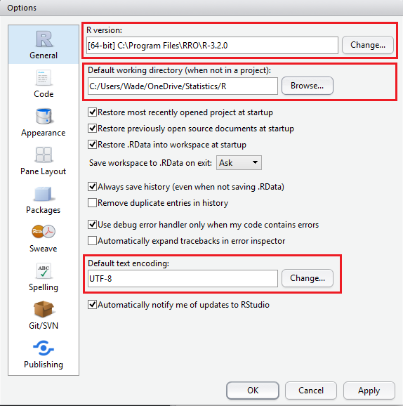
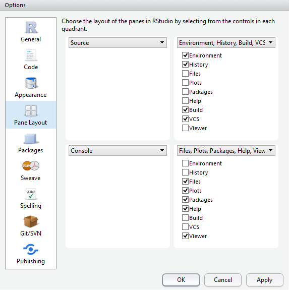
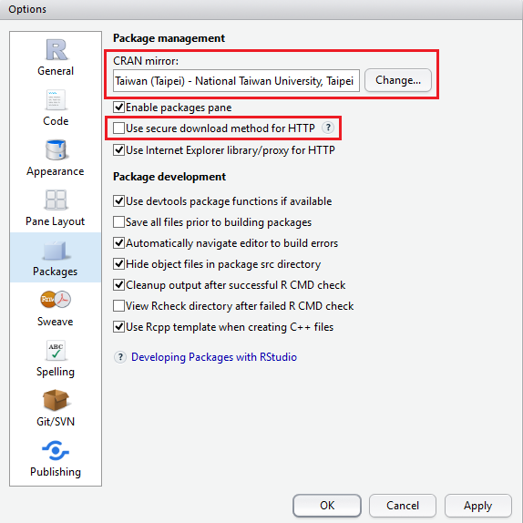
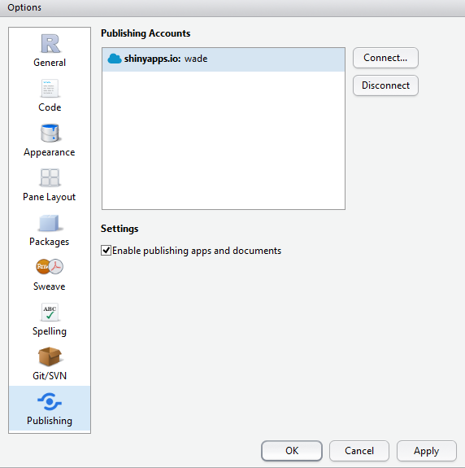

##軟體安裝順序##
1. Revolution R Open Math Library
2. Revolution R Open (RRO)
3. GitHub Desktop
4. RStudio

##RStudio教學與設定##
###RStudio教學###
* RStudio - R軟體的整合式開發環境介面教學<http://www.r-software.org/paper/rstudio-rruantidezhengheshikaifahuanjingjiemianjiaoxue>

###RStudio設定###
* Tools --> Global Options:
    + General: 確認R版本、預設工作目錄、文字檔編碼方式
    
    
    + Appearance: 設定程式碼字型、字型大小、風格主題
    
    
    + Pane Layout: 設定四個子工作視窗要擺那些東西
    
    
    + Packages: 設定Packages從哪裡下載、從MRAN下載要關掉HTTPS
    
    
    + Git/SVN: 設定版本控制、Git.exe的檔案位址
    
    
    + Publishing: 發布App到網頁、設定shinyapps.io的帳號
    
    
##R的Help文件與範例##
* help (明確知道要看哪一個function的help時):
```{r}
help(read.csv) # or ?(read.csv)
```

* help.search (搜尋關鍵字):
```{r}
??read.csv # or help.search(read.csv)
```

* args(functionname) 查看某個frunction有哪些參數
```{r}
args(read.csv)
```

* example (看function的程式範例):
```{r}
example(read.table)
```

* help(package = "packagename") 關於套件的資訊
```{r}
help(package = "base")
```

* vignette(package = "packagename") 查看套件裡面有哪些附帶文件
```{r}
vignette(package = "e1071")
#得知e1071套件中有一名為"svmdoc"的vignette
vignette("svmdoc")
#以PDF viewer開啟svmdoc說明黨
```

* 從rseek.org網站搜尋資訊
```{r}
#RSiteSearch("read.csv")
```

* 終極搜尋，在所有套件中搜尋關鍵字
```{r}
#install.packages("sos")
#library("sos")
#???acf
```

##安裝R的Package##
1. 從RStudio介面安裝: <br>


2. 下指令安裝，並指定Repository(當預設的Repository沒有要求的Package或特定版本，而必須另外指定時):
```{r}
#install.packages("rmarkdown", repos = "http://cran.us.r-project.org", type = "source")
```

3. 直接從GitHub安裝:
```{r}
#require(devtools)
#install_github("wch/ggplot2")
```

##R有6871個套件，我怎麼知道甚麼統計方法要用哪一個套件？
Ans: https://cran.r-project.org/web/views
```{r}
#install.packages("ctv")
#library("ctv")
#install.views("TimeSeries")
```