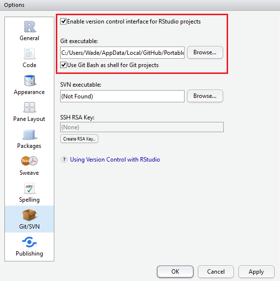

##軟體安裝順序##
1. Revolution R Open Math Library
2. Revolution R Open (RRO)
3. GitHub Desktop
4. RStudio

##RStudio教學與設定##
###RStudio教學###
* RStudio - R軟體的整合式開發環境介面教學<http://www.r-software.org/paper/rstudio-rruantidezhengheshikaifahuanjingjiemianjiaoxue>

###RStudio設定###
* Tools --> Global Options:
    + General: 確認R版本、預設工作目錄、文字檔編碼方式
    
    
    + Appearance: 設定程式碼字型、字型大小、風格主題
    
    
    + Pane Layout: 設定四個子工作視窗要擺那些東西
    
    
    + Packages: 設定Packages從哪裡下載、從MRAN下載要關掉HTTPS
    
    
    + Git/SVN: 設定版本控制、Git.exe的檔案位址
    
    
    + Publishing: 發布App到網頁、設定shinyapps.io的帳號
    
    
##R的Help文件與範例##
* Help(明確知道要看哪一個function的help時):
```{r}
help(read.csv)
```

* ??(搜尋關鍵字):
```{r}
??read.csv
```

* example (看函式的程式範例):
```{r}
example(read.table)
```